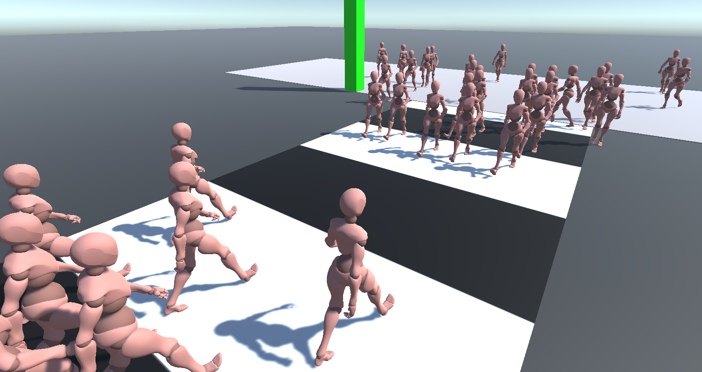

# Crossing Citizens
Small university project which goal is simulating a believable behaviour for two opposing flocks of pedestrians trying to cross a street. 

The project is implemented in Unity (editor version 2020.3.12f1) and can be tested through 3 example scenes, each with a different setting of parameters and quantity of citizens (light, medium or heavy crowd).

Further implementation details can be found on the .pdf in the Docs folder.
